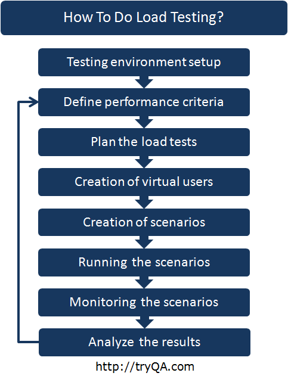

本文讲述如何从环境设置开始到报告生成结束执行一次完整的负载测试。

<!--more-->

## 什么是负载测试

负载测试是指在具体的负载下对系统行为和表现的观测和分析。

在网页应用的语境下，负载通常是指并发的大量用户。

## 负载测试流程

一个合理的测试流程应该包含四大步骤：

  1. 设置环境
  2. 制定计划
  3. 执行计划
  4. 生成报告

具体到负载测试，流程如下：

### 设置环境

包含步骤：`Testing environment setup`

尽可能接近地设置成和生产环境相同的测试环境。在规模上一般小于生产环境。

### 制定计划

包含步骤：`Define performance criteria` / `Plan the load tests`

测试计划应该详细描述整个负载测试的方方面面。一个得到测试计划的人，应该能够了解计划的目的，并且能够重新执行整个计划。

测试计划应该详细描述：

1. 测试背景、目的和要到达的标准
2. 测试环境和范围
3. 测试方法和步骤
4. 测试数据的来源
5. 可能的约束和问题
6. 测试结果的形式并设计相应图表

测试计划中性能标准通常包含延迟（Latency）、交通量（Traffic）、错误率（Errors）和饱和度（Satuation）。

上述四个是监控的四个黄金指标，出自Google的SRE（Site reliability engeenering）书。同样适用于负载测试。

对于网页应用，

延迟: 请求的响应时间。

交通量: 相当于吞吐量，每秒处理多少请求。

错误率: 如果是用http协议的话，看返回码是否符合预期来计算错误率。

饱和度: 指最受限资源的利用度。一般看系统的CPU, 内存，IO读写，网络。

测试计划一般会有模板，可以从收集到的模板出发，制定自己的测试计划。

### 执行计划

包含步骤：`Creation of virtual users` / `Creation of scenarios` / `Running the scenarios` / `Monitoring the scenarios`

这里就是该负载测试工具出场的时候了。负载测试工具能够帮助我们模拟虚拟用户，设计场景，执行测试以及帮助收集和统计数据。

一个常用和成熟的测试工具是[JMeter](https://jmeter.apache.org/). JMeter开源，广泛支持各类应用和协议，高扩展，支持图形界面，分布式测试等。

在功能和性能上，JMeter是不错的选择。但是毕竟项目成立的比较早，在配置文件上采用了XML格式，可读性差，不好编辑。一般是通过图形界面配置测试流程，测试完配置文件并保存后再以命令行的形式执行。图形界面在这里相当于一个编辑器。

之所以要以命令行形式执行，有几点原因：

1. 图形界面资源消耗大，影响并发数。尤其在大型测试时，容易造成JMeter崩溃。
2. 命令行方式能更容易嵌入到别的测试脚本中，实现自动化测试。

较现代的方式是将整个测试流程按代码编写，也即是Load test as code. 将所有的配置和测试脚本都以代码的形式给出，不需要图形界面，也容易阅读，同时也方便编写各类脚本。代码还可以托管在仓库上，在管理上也更方便了。

比如[Gatling](https://gatling.io/)就是类似的工具，但是它在支持的应用和协议上有所欠缺。部分功能需要收费，比如集群功能。

### 生成报告

包含步骤：`Analyze the results`

最终生成的报告相对于测试计划而言，除了填写具体的测试数据外，最重要的是对测试结果的分析和最终的结论。

测试报告应该包含：

1. 测试结果概要
2. 测试结果整理和评述
3. 性能统计和趋势分析
4. 性能瓶颈分析
5. 存在的问题和可能的原因

同样的，最终的测试报告也有相应模板，可从模板出发设计报告。
